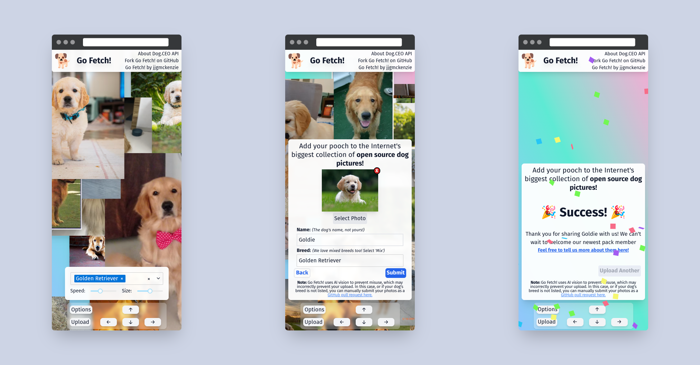
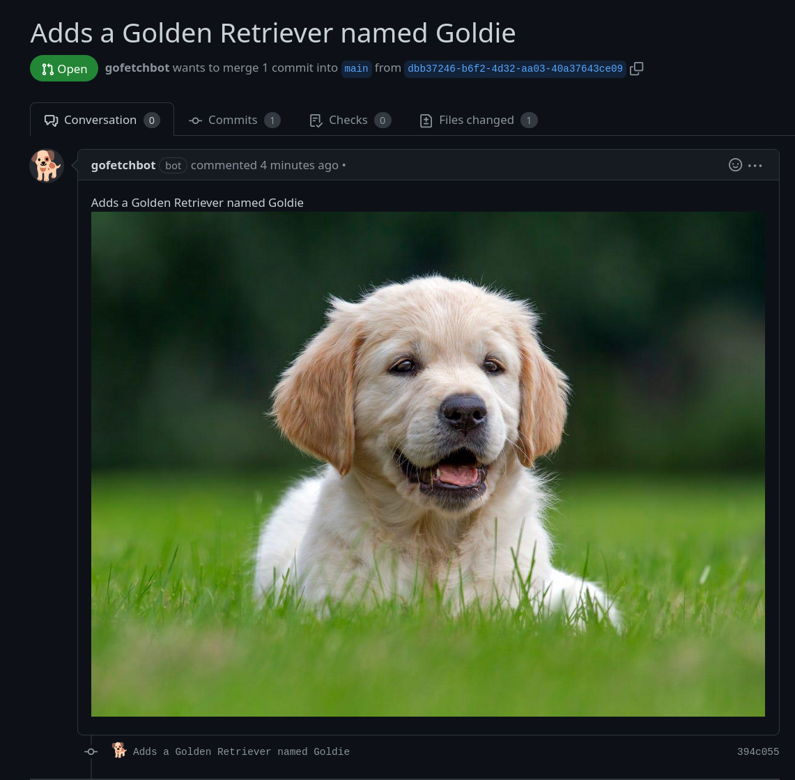
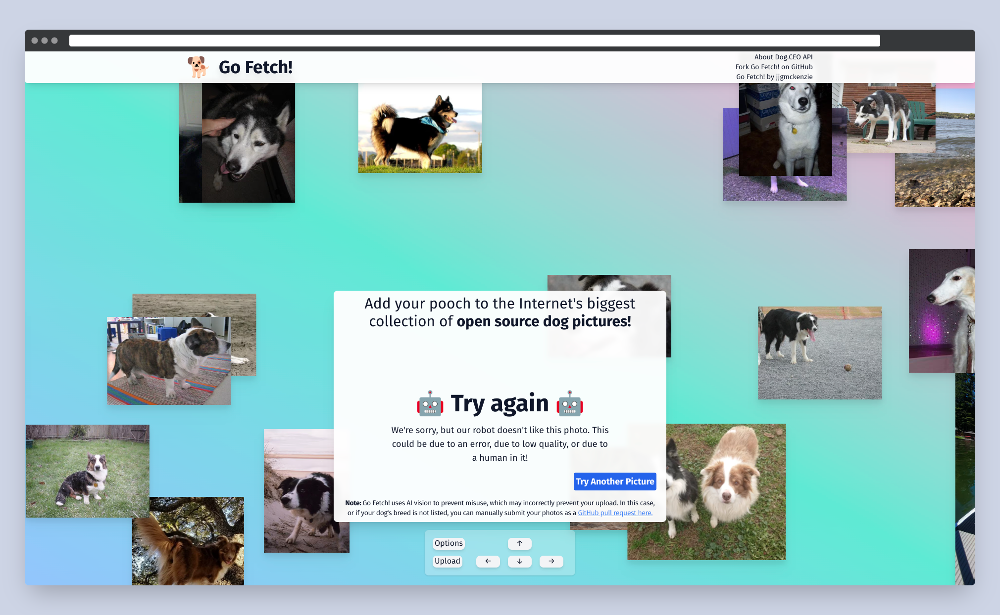

# Go Fetch! ( [Live](https://gofetch.jjgmckenzie.ca/) )

GoFetch is a web application written in NextJS / React, and styled with TailwindCSS; It allows users to view a stream of images from the [Dog CEO API](https://dog.ceo/dog-api/), being able to sort by breed.  Images are converted to AVIF & WebP by NextJS, and cached locally, so as to be considerate and keep excessive calls to the 3rd party API to a minimum.

## Pet-Form as a Service (PaaS)
Additionally, it connects to the backend, written in Go, to "GoFetchBot", a github application that accepts user submitted images of their dogs; scans them with a Neural Network for compliance (images must contain a dog, and may not contain a human, for GDPR reasons). If the image is acceptable, it creates a pull request with the image as a commit, for final human approval.

To reiterate: that makes it a Pet Form as a Service, using Neural Networks.

## Technical Details

- Golang, with 100% test coverage, tested with go test, using TDD & sticking to a "Given When Then" syntax 
- Some limited End to End Testing
- using GoCV and Yolov3 neural network
- NextJS / React, styled with TailwindCSS
-  Deployed to a personally administered docker server

### Forking 

I don't expect much attention on this repo; but this should be fairly easy to fork. The main requisite is either setting up openCV, or being comfortable using a docker container where openCV has been installed. 
The tests were written with a mock github repo (that has a LOT of closed PRs), so you will have to set up an application to get the same test coverage. Forker Beware: 
I am not proud of some of the React code, but I am pretty proud of the Go code, so...

### Other
Go ahead and shoot me an email or make an issue or reach out on my socials if this is interesting to you or you want to chat!

### License

GPLv3
